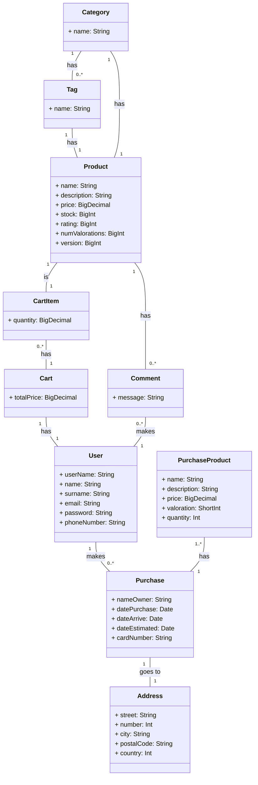
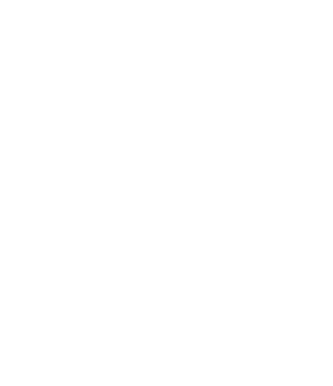

# Project Class Diagram

```mermaid
classDiagram
    Tag "1" -- "1" Product : has
    Category "1" -- "1" Product : has
    Category "1" -- "0..*" Tag : has
    Product "1" -- "1" CartItem : is
    CartItem "0..*" -- "1" Cart : has
    Cart "1" -- "1" User : has
    Product "1" -- "0..*" Comment : has
    Comment "0..*" -- "1" User : makes
    User "1" -- "0..*" Purchase : makes
    PurchaseProduct "1..*" -- "1" Purchase : has
    Purchase "1" -- "1" Address : goes to
    
    
    class Category{
        + name: String
    }
    
    class Tag{
        + name: String
    }
    
    class Product{
        + name: String
        + description: String
        + price: BigDecimal
        + stock: BigInt
        + rating: BigInt
        + numValorations: BigInt
        + version: BigInt
    }
    
    class CartItem{
        + quantity: BigDecimal  
    }
    
    class Cart{
        + totalPrice: BigDecimal
    }
    
    class User{
        + userName: String
        + name: String
        + surname: String
        + email: String
        + password: String
        + phoneNumber: String
    }
    
    class Comment{
        + message: String
    }
    
    class PurchaseProduct{
        + name: String
        + description: String
        + price: BigDecimal
        + valoration: ShortInt
        + quantity: Int
    }
    
    class Purchase{
        + nameOwner: String
        + datePurchase: Date
        + dateArrive: Date
        + dateEstimated: Date
        + cardNumber: String
    }
    
    class Address{
        + street: String
        + number: Int
        + city: String
        + postalCode: String
        + country: Int
    }
```

# Relational Scheme

